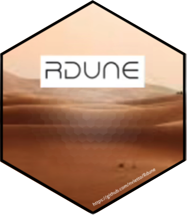
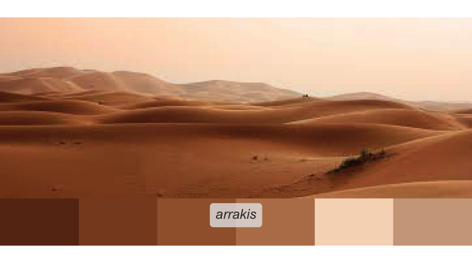
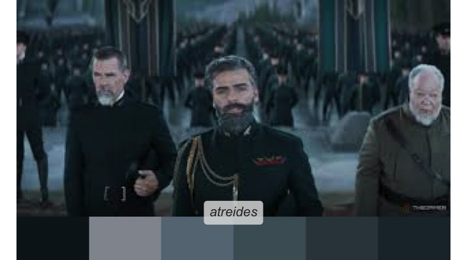
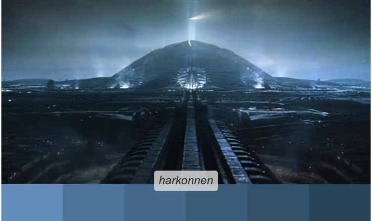

<!-- README.md is generated from README.Rmd. Please edit that file -->

```{r, include = FALSE}
knitr::opts_chunk$set(
  collapse = TRUE,
  comment = "#>",
  fig.path = "man/figures/README-",
  out.width = "100%"
)
```


# Rdune 

The {Rdune} package offers a collection of color palettes inspired by "Dune," designed for use in data visualizations and graphics with {ggplot2}.

The structure of the code and creative inspiration were drawn from the [{PrettyCols}](https://github.com/nrennie/PrettyCols), [{wesanderson}](https://github.com/karthik/wesanderson), [{MetBrewer}](https://github.com/BlakeRMills/MetBrewer), [{PNWColors}](https://github.com/jakelawlor/PNWColors) packages.


Colors were selected using [{eyedroppeR}](https://github.com/doehm/eyedroppeR).

## Installation

You can install the development version of Rdune from [GitHub](https://github.com/) with:

``` r
# install.packages("devtools")
devtools::install_github("nvietto/Rdune")
```

## How to use

```{r example}
library(Rdune)

# See all palettes
names(dune_palettes)

```

## View palette

```{r, fig.height = 2}

pal <- dune_palette("atreides")

print.palette(pal)


```

## Examples

### "May thy knife chip and shatter"

<p align="center">
  
</p>


```{r, example1, fig.height=3}
library(ggplot2)

ggplot(data = iris,
    mapping = aes(x = Sepal.Width, y = Sepal.Length, color = Species)) + 
    geom_point(size = 2) + 
    scale_color_dune_d(name = "maythyknifechipandshatter")

```


### House Atreides 

<p align="center">
  
</p>


```{r, example2, fig.height=3}
library(ggplot2)

ggplot(data.frame(x = rnorm(1000), y = rnorm(1000)),
       aes(x = x, y = y)) +
  geom_hex() + 
  theme_minimal() +
  scale_fill_dune_c(name = "atreides3") +
  labs(x = "X-axis", y = "Y-axis", fill = "Legend")


```


## Palettes

### Arrakis

<p align="center">
  
</p>


### House Atreides

<p align="center">
  
</p>

<p align="center">
  
</p>


<p align="center">
  
</p>

<p align="center">
  
</p>


### Bene Gesserit

<p align="center">
  
</p>


### House Corrino

<p align="center">
  
</p>

### Fremen

<p align="center">
  
</p>


<p align="center">
  
</p>


### House Harkonnen

<p align="center">
  
</p>

<p align="center">
  
</p>


<p align="center">
  
</p>


<p align="center">
  
</p>


### "May thy knife chip and shatter"

<p align="center">
  
</p>


<p align="center">
  
</p>

### Sandworm 


<p align="center">
  
</p>


### Sardaukar

<p align="center">
  
</p>


### "What is in the box?"

<p align="center">
  
</p>


