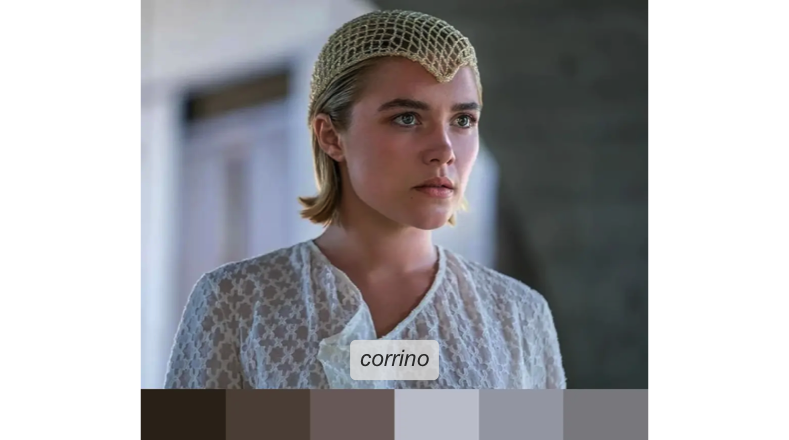
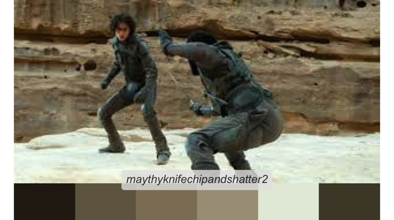
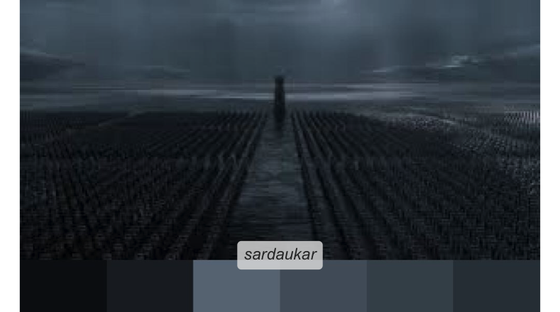

<!-- README.md is generated from README.Rmd. Please edit that file -->

# Rdune

{Rdune} provides color palettes inspired from Dune.

Structure of the package was based on coding from the
[{PrettyCols}](https://github.com/nrennie/PrettyCols),
[{wesanderson}](https://github.com/karthik/wesanderson),
[{MetBrewer}](https://github.com/BlakeRMills/MetBrewer),
[{vangogh}](https://github.com/cherylisabella/vangogh) packages.

Colors were selected using
[{eyedroppeR}](https://github.com/doehm/eyedroppeR).

## Installation

You can install the development version of Rdune from
[GitHub](https://github.com/) with:

``` r
# install.packages("devtools")
devtools::install_github("nvietto/Rdune")
```

## How to use

``` r
library(Rdune)

# See all palettes
names(dune_palettes)
#>  [1] "arrakis"                    "atreides"                  
#>  [3] "atreides2"                  "atreides3"                 
#>  [5] "bene_gesserit"              "corrino"                   
#>  [7] "fermen"                     "harkonnen"                 
#>  [9] "harkonnen2"                 "harkonnen3"                
#> [11] "harkonnen_4"                "maythyknifechipandshatter" 
#> [13] "maythyknifechipandshatter2" "sandworm"                  
#> [15] "sardaukar"                  "whatsinthebox"
```

## Palettes

### Arrakis

 \### House Atreides

 


### Bene Gesserit


### House Corrino



### Fremen


### House Harkonnen


### “May thy knife chip and shatter”




### Sandworm


### Sardaukar



### What is in the box?


