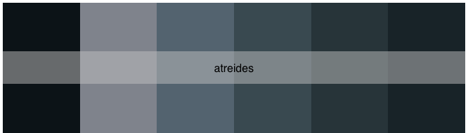

<!-- README.md is generated from README.Rmd. Please edit that file -->

# Rdune 

The {Rdune} package offers a collection of color palettes inspired by
“Dune,” designed for use in data visualizations and graphics with
{ggplot2}.

The structure of the code and creative inspiration were drawn from the
[{PrettyCols}](https://github.com/nrennie/PrettyCols),
[{wesanderson}](https://github.com/karthik/wesanderson),
[{MetBrewer}](https://github.com/BlakeRMills/MetBrewer),
[{PNWColors}](https://github.com/jakelawlor/PNWColors) packages.

Colors were selected using
[{eyedroppeR}](https://github.com/doehm/eyedroppeR).

## Installation

You can install the development version of Rdune from
[GitHub](https://github.com/) with:

``` r
# install.packages("devtools")
devtools::install_github("nvietto/Rdune")
```

## How to use

``` r
library(Rdune)

# See all palettes
names(dune_palettes)
#>  [1] "arrakis"                    "atreides"                  
#>  [3] "atreides2"                  "atreides3"                 
#>  [5] "bene_gesserit"              "corrino"                   
#>  [7] "fermen"                     "fermen2"                   
#>  [9] "harkonnen"                  "harkonnen2"                
#> [11] "harkonnen3"                 "harkonnen4"                
#> [13] "maythyknifechipandshatter"  "maythyknifechipandshatter2"
#> [15] "sandworm"                   "sardaukar"                 
#> [17] "whatsinthebox"
```

## View palette

``` r

pal <- dune_palette("atreides")

print.palette(pal)
```



## Examples

### “May thy knife chip and shatter”

<p align="center">

</p>

``` r
library(ggplot2)

ggplot(data = iris,
    mapping = aes(x = Sepal.Width, y = Sepal.Length, color = Species)) + 
    geom_point(size = 2) + 
    scale_color_dune_d(name = "maythyknifechipandshatter")
```


### House Atreides

<p align="center">

</p>

``` r
library(ggplot2)

ggplot(data.frame(x = rnorm(10000), y = rnorm(10000)),
       aes(x = x, y = y)) +
  geom_hex() + 
  theme_minimal() +
  scale_fill_dune_c(name = "atreides3") +
  labs(x = "X-axis Label", y = "Y-axis Label", fill = "Legend")
```


## Palettes

### Arrakis

<p align="center">

</p>

### House Atreides

<p align="center">

</p>
<p align="center">

</p>
<p align="center">

</p>

### Bene Gesserit

<p align="center">

</p>

### House Corrino

<p align="center">

</p>

### Fremen

<p align="center">

</p>
<p align="center">

</p>

### House Harkonnen

<p align="center">

</p>
<p align="center">

</p>
<p align="center">

</p>
<p align="center">

</p>

### “May thy knife chip and shatter”

<p align="center">

</p>
<p align="center">

</p>

### Sandworm

<p align="center">

</p>

### Sardaukar

<p align="center">

</p>

### “What is in the box?”

<p align="center">

</p>
