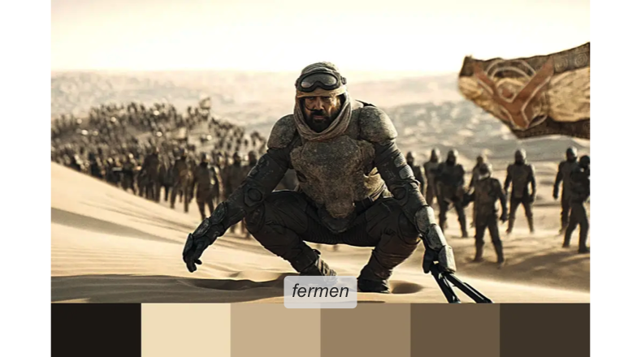
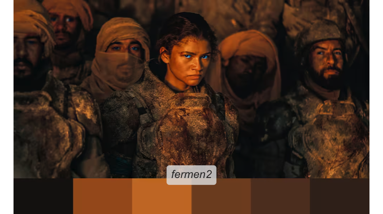

<!-- README.md is generated from README.Rmd. Please edit that file -->

# Rdune 

<!-- badges: start -->

[](https://github.com/nvietto/Rdune/actions/workflows/R-CMD-check.yaml)
[](https://CRAN.R-project.org/package=Rdune)
[](https://cran.r-project.org/package=Rdune)
<!-- badges: end -->

The {Rdune} package offers a collection of color palettes inspired by
‘Dune’, designed for use in data visualizations and graphics with
{ggplot2}.

The structure of the code and creative inspiration were drawn from the
[{PrettyCols}](https://github.com/nrennie/PrettyCols),
[{wesanderson}](https://github.com/karthik/wesanderson),
[{MetBrewer}](https://github.com/BlakeRMills/MetBrewer),
[{PNWColors}](https://github.com/jakelawlor/PNWColors) packages.

Colors were selected using
[{eyedroppeR}](https://github.com/doehm/eyedroppeR).

See <https://nvietto.github.io/Rdune/> for full documentation.

## Installation

{Rdune} is available on CRAN. Install using:

``` r
install.packages("Rdune")
```

Or you can install the development version of Rdune from
[GitHub](https://github.com/) with:

``` r
# install.packages("devtools")
devtools::install_github("nvietto/Rdune")
```

## How to use

``` r
library(Rdune)

# See all palettes
names(dune_palettes)
#>  [1] "arrakis"                   "atreides"                 
#>  [3] "atreides2"                 "atreides3"                
#>  [5] "atreides4"                 "bene_gesserit"            
#>  [7] "corrino"                   "fermen"                   
#>  [9] "fermen2"                   "harkonnen"                
#> [11] "harkonnen2"                "harkonnen3"               
#> [13] "harkonnen4"                "maythyknifechipandshatter"
#> [15] "sandworm"
```

## View palette

``` r
pal <- dune_palette("atreides")

print.palette(pal)
```


## Examples

### “May thy knife chip and shatter”

<p align="center">

</p>

``` r
library(ggplot2)

ggplot(
  data = iris,
  mapping = aes(x = Sepal.Width, y = Sepal.Length, color = Species)
) +
  geom_point(size = 2) +
  scale_color_dune_d(name = "maythyknifechipandshatter")
```


### House Atreides

<p align="center">

</p>

``` r
library(ggplot2)

ggplot(
  data.frame(x = rnorm(1000), y = rnorm(1000)),
  aes(x = x, y = y)
) +
  geom_hex() +
  theme_minimal() +
  scale_fill_dune_c(name = "atreides3") +
  labs(x = "X-axis", y = "Y-axis", fill = "Legend")
```


## Palettes

### Arrakis

<p align="center">

</p>

### House Atreides

<p align="center">

</p>
<p align="center">

</p>
<p align="center">

</p>
<p align="center">

</p>

### Bene Gesserit

<p align="center">

</p>

### House Corrino

<p align="center">

</p>

### Fremen

<p align="center">

</p>
<p align="center">

</p>

### House Harkonnen

<p align="center">

</p>
<p align="center">

</p>
<p align="center">

</p>
<p align="center">

</p>

### “May thy knife chip and shatter”

<p align="center">

</p>

### Sandworm

<p align="center">

</p>
