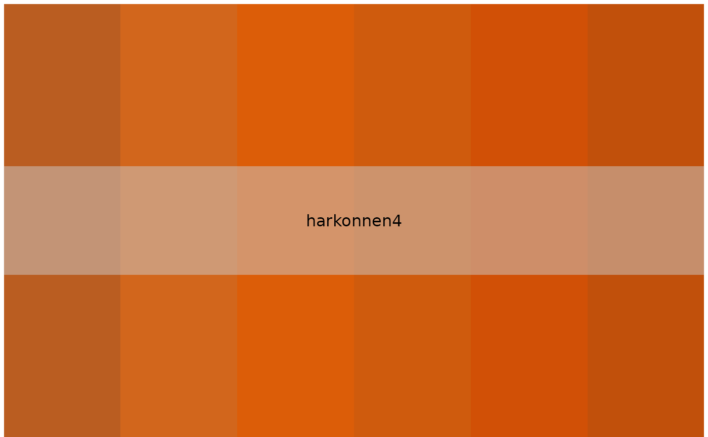
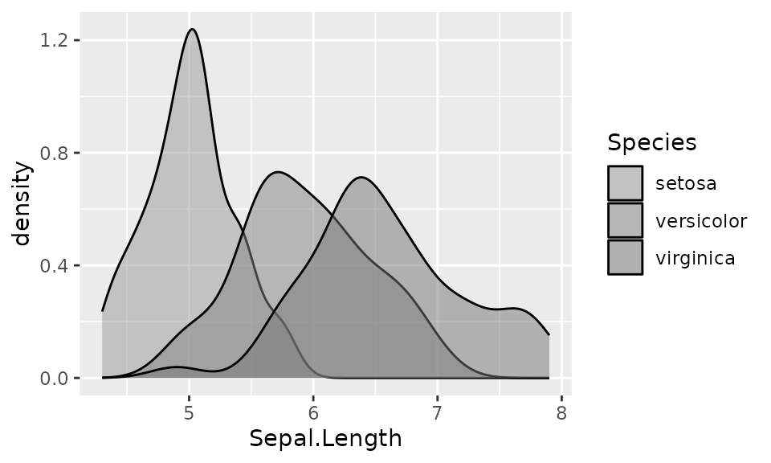
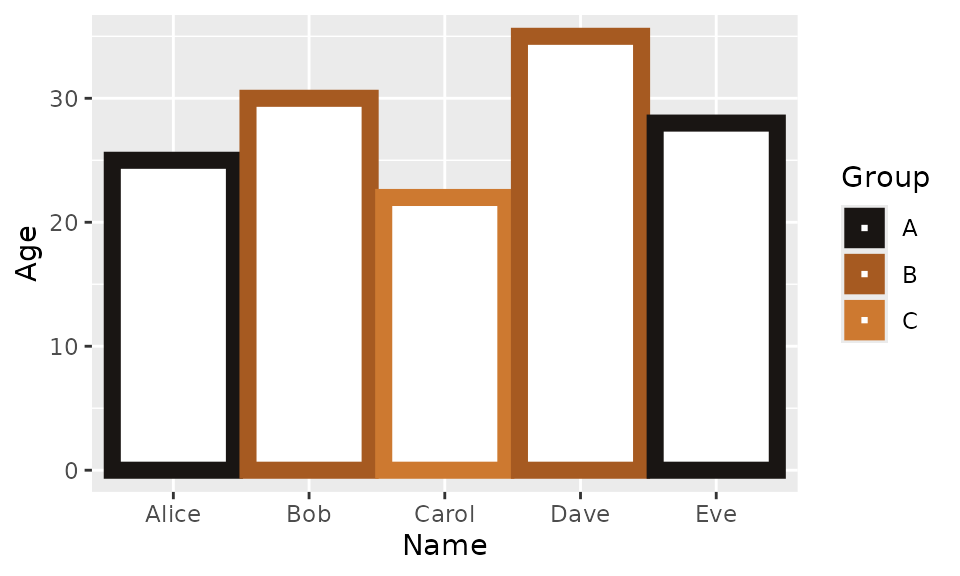
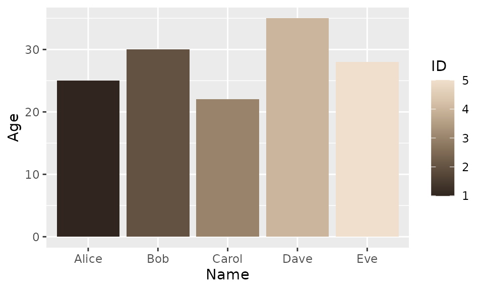
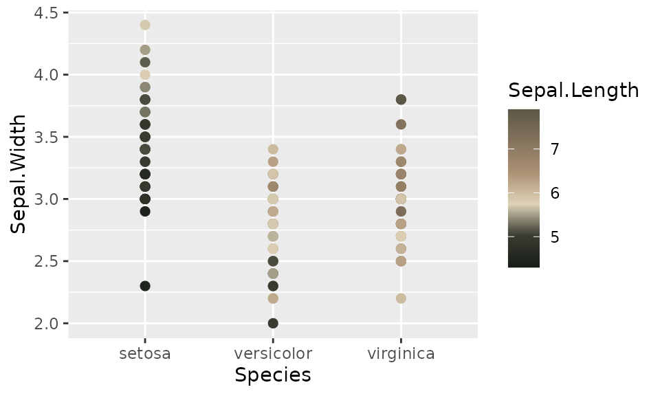

# ggplot2-vignette

## Install

Be sure to uncomment and execute the two lines of code. This will enable
you to utilize the developmental versions of the package.

``` r

# install.packages("devtools")
# devtools::install_github("nvietto/Rdune")

library(Rdune)
```

## Names

``` r

names(dune_palettes)
#>  [1] "arrakis"                   "atreides"                 
#>  [3] "atreides2"                 "atreides3"                
#>  [5] "atreides4"                 "bene_gesserit"            
#>  [7] "corrino"                   "fermen"                   
#>  [9] "fermen2"                   "harkonnen"                
#> [11] "harkonnen2"                "harkonnen3"               
#> [13] "harkonnen4"                "maythyknifechipandshatter"
#> [15] "sandworm"
```

## Print colors

``` r

pal <- dune_palette("harkonnen4")

print.palette(pal)
```



## Data

``` r

df <- data.frame(
  ID = 1:5,
  Name = c("Alice", "Bob", "Carol", "Dave", "Eve"),
  Age = c(25, 30, 22, 35, 28),
  Group = c("A", "B", "C", "B", "A")
)
```

## Discrete

``` r

library(ggplot2)
ggplot(
  data = iris,
  mapping = aes(x = Sepal.Length, fill = Species)
) +
  geom_density(alpha = 0.5) +
  scale_fill_dune_d(name = "harkonnen2")
```



``` r

ggplot(
  data = df,
  mapping = aes(x = Name, y = Age, color = Group)
) +
  geom_col(linewidth = 3, fill = "white") +
  scale_color_dune_d(name = "fermen2")
```



## Continious

``` r

ggplot(
  data = df,
  mapping = aes(x = Name, y = Age, fill = ID)
) +
  geom_col() + 
  scale_fill_dune_c("harkonnen3")
```



``` r


ggplot(
  data = iris,
  mapping = aes(x = Species, y = Sepal.Width, color = Sepal.Length)
) +
  geom_point(size = 2) +
  scale_color_dune_c(name = "sandworm")
```


